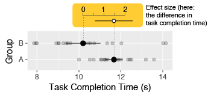

<div style="text-align:center">

</div>
```
TODO: generate the teaser figure in code
```

# FAQ

## What is effect size?
Broadly speaking, an effect size is *"anything that might be of interest"* [@Cumming2013a]; it is some quantity that captures the practical magnitude of the effect studied. 

While the term *effect size* may conjure up the image of arcane statistical formulas---much like the term *test statistic* might---the most useful effect sizes are often much simpler, and more intuitive, than perhaps should even warrant a specialized term. An effect size is *essentially* any way to compute the practical size of an effect. It can be something as simple as the difference between the means of two treatments, and often this is a very informative measure that can tell you whether a treatment has an effect large enough to care about. For example, the *difference* in task completion time (in seconds) between two interfaces or the *difference* in error rate (in percentage points) between two interfaces.

The term *effect size* is an overloaded term: sometimes it is used to refer to *standardized* effect sizes, like Cohen’s *d*, and sometimes to *simple* effect sizes, like the difference between two means. This can lead to confusion. In the rest of this document we will qualify the term *effect size* as *simple* or *standardized* whenever used to be as unambiguous as possible.

▸ Exemplar: [simple effect size](#exemplar_simple_effect_size) and [standardized effect size](#exemplar_standardized_effect_size)

## Why and when should effect sizes be reported?
Taken in a broad sense, effect sizes should always be reported in quantitative research unless there are good reasons not to do so. Effect sizes are essential for understanding the practical importance of research. Identifying the effect size of interest can turn a broader research question into a precise, quantitative question. For example, if a researcher is interested in showing that their technique is faster than a baseline technique, an appropriate choice of effect size could be the mean difference in completion time.

<a id="faq_how_reporting"></a>

## How should effect sizes be reported?
There are many ways to report effect sizes. One can choose to report simple effect sizes or standardized effect sizes (see [Should simple effect sizes or standardized effect sizes be reported?](#faq_simple_v_standardized)). Effect sizes can be reported textually or graphically. They are all acceptable, although graphical reports tend to be easier to comprehend than textual reports, and simple effect sizes are easier to interpret than standardized effect sizes for measures reported in familiar units such as completion times [@Wilkinson1999a, @Cumming2013a, @Cummings2011]. 

Effect size should be reported together with an appropriate measure of error to show the degree of uncertainty. For example, when reporting the mean difference, one could report the standard error, a confidence interval (e.g. a 95% CI or a 68% CI), or a Bayesian posterior distribution, depending on the model or test used.

In sum, an effect size report should include:

- The direction of the effect if applicable (e.g., given a difference between two treatments `A` and `B`, indicate if the measured effect is `A - B` or `B - A`).
- The type of estimate reported (e.g., mean difference)
- The type of uncertainty reported (e.g., 95% CI)
- The units of the effect size if applicable, or the type of standardized effect size if it is a unitless effect size. 

▸ Exemplar: [simple effect size](#exemplar_simple_effect_size) (specifically in the "Reporting simple effect size" sub-section)

<a id="faq_simple_v_standardized"></a>

## Should simple effect sizes or standardized effect sizes be reported?
Cohen’s *d* --- the difference in means divided by the standard deviation --- is sometimes called a standardized effect size (there are others). Standardized effect sizes may be useful in some situations, for example when effects measured in different units need to be combined or compared, although even this practice is controversial [@Cumming2014a] as it can rely on assumptions about the effects being measured that are difficult to verify [@Cummings2011]. 

Often, a simple effect size is easier to interpret and justify [@Cumming2014a; @Cummings2011]. When the units of the data are meaningful, a simple effect size can make it easier to judge whether the size of the effect has practical significance [@Wilkinson1999a]; it allows experts to use their domain knowledge to judge the practical size of the effect [@Cumming2014a; @Cummings2011]. Barring a strong, domain- or problem-specific argument for reporting a standardized effect size instead of a simple one, simple effect sizes should be preferred as being more transparent and easier to interpret.

If a standardized effect size is reported, it should be accompanied by an argument for its applicability to the domain. If there is no inherent reasoning to argue for a particular interpretation of the practical significance of the standardized effect size, it should also be accompanied by another assessment of the practical significance of the effect.

For meta-analysis, standardized effect sizes can be derived from simple effect sizes [reported with complete information](#faq_how_reporting).


## How do you know if an effect size is large enough?
Deciding if an effect size is “large enough” often requires expert judgement. Is a difference of 100ms a large difference in reaction time? Is a difference of 100ms a large difference in time to receive a chat message? Expert judgment combined with reference to prior studies of related phenomena can help adjudicate.

We believe simple effect sizes are more transparent, because they provide the information necessary for an expert in the area to use their judgment to assess the practical impact of an effect size. For example, a difference in reaction time of 100ms is above the threshold of human perception, and therefore likely of practical impact. A difference of 100ms in receiving a chat message in an asynchronous chat application is likely less impactful, as it is small compared to the amount of time a chat message is generally expected to take. A difference in pointing time of 100ms between two pointing techniques might be large or small depending on the application, how often it is used, the context of use, etc. Presenting simple effect sizes in a clear way---with units---allows the expert author to argue why the effect size may or may not have practical importance *and* allow the expert reader to make their own judgment.

In practice, a researcher should think in advance what would be an effect size they would like to see in their data from the treatment, and then design an experiment that is likely to be able to detect an effect of this size (see [planned analyses](planned_analyses) and [power analysis](power_analysis). This might then be considered "large enough" for that experiment.

▸ Exemplar: [simple effect size](#exemplar_simple_effect_size) (specifically in the "Interpreting effect size" sub-section)

## What about "small", "medium", and "large" values of Cohen's *d*?
In some literatures, informal thresholds are used for standardized effect sizes like Cohen’s *d*, labeling them "small", "medium", or "large". These thresholds are largely arbitrary [@Cummings2011] and are not truly domain agnostic. These thresholds were originally proposed by Cohen based on human heights and intelligence quotients [@Cohen1977], but Cohen, in the very text where he first introduced them, noted that these thresholds may not be directly applicable to other domains:

> The terms "small", "medium", and "large" are relative, not only to
each other, but to the area of behavioral science or even more particularly
to the specific content and research method being employed in any given
investigation... In the face of this relativity, there is
a certain risk inherent in offering conventional operational definitions for
these terms for use in power analysis in as diverse a field of inquiry as behavioral
science. This risk is nevertheless accepted in the belief that more
is to be gained than lost by supplying a common conventional frame of
reference which is recommended for use only when no better basis for estimating
the ES index is available. [@Cohen1977]

Cohen recommended the use of these thresholds only when no better frame of reference for assessing practical importance was available; he believed the risk in offering conventional thresholds was small. **We disagree.** We believe that hindsight has demonstrated that if such thresholds are offered, they will be adopted as a convenience, often without much thought to how they apply to the domain at hand. Once adopted, these thresholds make reports more opaque: by standardizing away the units of measurement, it can become more difficult for domain experts to judge practical importance. Therefore, like Cummings [@Cummings2011], **we recommend against the use of standardized effect sizes interpreted using Cohen's thresholds**; justification should be provided both for the use of standardized effect sizes and thresholds on them, and those justifications should not refer to arbitrary standards like those proposed by Cohen.

More generally, it is beneficial to avoid the use of arbitrary thresholds or dichotomous thinking when deciding on whether an effect is large enough, and instead to try to think whether the effect is of practical importance. This requires domain knowledge and analysis, often aided by simple effect sizes.

<a id="exemplar_simple_effect_size"></a>

# Exemplar: Simple effect size


## Libraries needed for this analysis

```{r setup, warning = FALSE, message = FALSE}
library(tidyverse)
library(forcats)    # for fct_...()
library(broom)      # for tidy()
library(ggstance)   # for geom_pointrangeh()
library(brms)       # for brm()
library(tidybayes)  # for mean_qi(); use devtools::install_github("mjskay/tidybayes") to install
import::from(MASS, mvrnorm)
```
This function is for formatting numbers:

```{r boilerplate, include = FALSE}
format_num <- function(nums, sigdigits = 3) gsub("\\.$", "", formatC(nums, sigdigits, format = "fg", flag="#"))
```


## Data

Imagine a between-subjects design, with completion time (in milliseconds) measured in two groups, `A` and `B`, with 20 subjects each.

```{r data_generation}
set.seed(12)
n <- 20
data <- tibble(
  group = rep(c("A", "B"), each = n),
  completion_time_ms = c(
    rlnorm(n, meanlog = log(170), sdlog = 0.3),
    rlnorm(n, meanlog = log(50), sdlog = 0.4)
  )
)
```

We assume a log-normal model of completion times, which is a commonly-used model of completion time [citation needed] and ensures completion times are all positive.

A good first step in any analysis is always to visualize the data:

```{r data_plot, fig.height = 2, fig.width = 4}
p_data <-  # save for the teaser figure
  data %>% 
  mutate(group = fct_rev(group)) %>%  # to display groups in alphabetical order
  ggplot(aes(x = group, y = completion_time_ms)) +
  geom_point(alpha = 0.2) +
  stat_summary(fun.data = mean_cl_normal) +
  coord_flip() +
  ylab("Completion time (ms)") +
  xlab("Group")
p_data
```

This plot shows all observed completion times, as well as the mean completion time and 95% confidence interval of the mean in each condition.

## Calculating simple effect size

Since we have meaningful units (milliseconds), we will use the *difference* in mean completion times as our effect size. Following [our recommendations on how to report effect size](#faq_how_reporting), we also need to report the uncertainty around the sample effect size. We will show several different approaches to calculating the uncertainty around this effect. 

### Approach 1: Difference in means with Student's t confidence interval

While the response distributions are non-normal, the sampling distribution of the difference in means will still be approximately symmetrical [citation needed / double check this], so we can compute a *Student's t distribution confidence interval* for the difference in means.

```{r t_test}
t_result <- 
  t.test(completion_time_ms ~ group, data = data) %>%
  tidy()    # put result in tidy tabular format
t_result
```

The `tidy()`ed output of the `t.test()` function includes an estimate of the mean difference in milliseconds (`estimate`) as well as the lower (`conf.low`) and upper (`conf.high`) bounds of the 95% confidence interval. 

### Approach 2a: Ratio of medians with Student's t confidence interval on log-scale

For responses that are assumed to be log-normal, an alternative is to calculate the mean difference on the log scale. Because the mean on the log scale of a log-normal distribution is equal to the median of the distribution of the untransformed responses, this is equivalent to calculating a ratio of medians on the untransformed scale (in this case, a ratio of median response times). See the [data transformation](data_transformation) guideline for more information.

```{r log_t_test}
log_t_result <- 
  t.test(log(completion_time_ms) ~ group, data = data) %>%
  tidy()    # put result in tidy tabular format
log_t_result
```

We can transform this into a ratio of median response times:

```{r log_t_to_ratio}
log_t_ratios <- log_t_result %>%
  mutate_at(vars(estimate, estimate1, estimate2, conf.low, conf.high), exp)
log_t_ratios
```

This output shows the estimated median response times (`estimate1` and `estimate2`), and an estimate of the ratio between them (`estimate = estimate1/estimate2`) as well as the lower (`conf.low`) and upper (`conf.high`) bounds of the 95% confidence interval of that ratio.

### Approach 2b: log-normal regression with marginal estimate of difference in means using simulation

We can run a linear regression that is equivalent to approach 2a:

```{r}
m_log <- lm(log(completion_time_ms) ~ group, data = data)
m_log
```

Then we can simulate means on the log scale from the sampling distribution of the coefficients of this model, and use the fact that if a random variable $X$ is log-normally distributed with mean $\mu$ and standard deviation $\sigma$:

$$
\log(X) \sim \mathrm{Normal}(\mu, \sigma^2)
$$

Then the mean of $X$ is (see [here](https://en.wikipedia.org/wiki/Log-normal_distribution)):

$$
\mathbf{E}[X] = e^{\mu+\frac{\sigma^2}{2}}
$$

We can use the sampling distribution of the coefficients of `m_log` to generate samples of $\mu$ in each group, then translate these samples (along with an estimate of $\sigma$) onto the outcome scale, then derive intervals on that scale (this is sort of treating the sampling distribution as a Bayesian posterior):

```{r}
log_result <- 
  mvrnorm(10000, mu = coef(m_log), Sigma = vcov(m_log)) %>%
  as_data_frame() %>%
  mutate(
    sigma = sigma(m_log), # Using MLE estimate of residual SD
                          # could also sample from sqrt(rgamma(nrow(.), (n - 1)/2, ((n - 1)/sigma(m_log)^2)/2))
                          # but results are similar
    
    mu_A = `(Intercept)`,
    mean_A = exp(mu_A + sigma^2 / 2),
    
    mu_B = `(Intercept)` + groupB,
    mean_B = exp(mu_B + sigma^2 / 2),
    
    mean_difference = mean_A - mean_B
  ) %>%
  mean_qi(mean_difference) %>%
  mutate(method = "lognormal regression")
log_result
```

This approach does not account for non-constant variance on the log scale, however. The next approach does.

### Approach 3: log-normal regression with marginal estimate of difference in means using Bayesian regression

For this approach, we will use a Bayesian log-normal regression model to estimate the mean and variance of the response distribution in each group on a log scale. We will then transform these parameters into a difference in means on the original (millisecond) scale, as in approach 2b.

First, a Bayesian log-normal regression with default priors:

```{r, results = "hide"}
m_log_bayes <- brm(brmsformula(
    completion_time_ms ~ group,
    sigma ~ group
  ), data = data, family = lognormal)
```

We can use samples from the posterior distribution to derive the mean response time in each condition and a credible interval around their difference:

```{r}
log_bayes_result <- m_log_bayes %>%
  as_data_frame() %>%
  mutate(
    mu_A = b_Intercept,
    sigma_A = exp(b_sigma_Intercept),
    mean_A = exp(mu_A + sigma_A^2 / 2),
    
    mu_B = b_Intercept + b_groupB,
    sigma_B = exp(b_sigma_Intercept + b_sigma_groupB),
    mean_B = exp(mu_B + sigma_B^2 / 2),
    
    mean_difference = mean_A - mean_B
  ) %>%
  mean_qi(mean_difference) %>%
  mutate(method = "lognormal regression (Bayesian)")
log_bayes_result
```

This gives the estimated mean difference between conditions in milliseconds (`mean_difference`), as well as the lower (`mean_difference.lower`) and upper (`mean_difference.upper`) bounds of the 95% quantile credible interval of that ratio.

### Comparing approaches

All approaches that give estimates for the difference in means that are essentially the same:

```{r}
t_result %>%
  transmute(
    mean_difference = estimate, mean_difference.lower = conf.low, mean_difference.upper = conf.high,
    mean_difference.prob = 0.95, method
  ) %>%
  bind_rows(log_result, log_bayes_result) %>%
  ggplot(aes(y = method, x = mean_difference, xmin = mean_difference.lower, xmax = mean_difference.upper)) + 
  geom_pointrangeh() +
  geom_vline(xintercept = 0)
```


## Reporting simple effect size

Ideally, we would have space in our paper to report the effect size graphically:

```{r ci_plot, fig.height = 1, fig.width = 5}
p_simple_effect_size <-   # save for the teaser figure
  t_result %>% 
  ggplot(aes(y = "A - B", x = estimate, xmin = conf.low, xmax = conf.high)) +
  geom_pointrangeh() +
  geom_vline(xintercept = 0, linetype="dashed") +
  xlab("Mean difference in completion time (ms) with 95% CI") +
  ylab("")
p_simple_effect_size
```

This graphical report includes all of the [elements of an effect size report that we recommend](#how):

- The direction of the difference (indicated by the label `A - B`)
- The type of estimate reported (mean difference)
- The type of uncertainty indicated (95% CI)
- The units (ms)

Space may not always permit the graphical report. While it can be less easy to interpret, an alternative is a textual report. **Such a report should still include all of the four elements listed above.** For example:

> Group `A` had a greater mean completion time than group `B` by `r format_num(t_result$estimate, 2)` milliseconds (95% CI: [`r format_num(t_result$conf.low, 2)`, `r format_num(t_result$conf.high, 2)`]).


## Interpreting effect size: same result, different domains = different interpretations

Because simple effect sizes include units, we can use our expert judgment to interpret the report. Authors may wish to do so in order to put their result in context. Because the report above includes everything necessary for other experts to come to their own conclusion, providing our own interpretation does not prevent readers from applying their own judgment and coming to different conclusions.

To illustrate the effect of domain on interpreting effect size, we will imagine two different domains that might have led to the same result reported above, and write a different interpretation of the data for each.


### Domain 1: Physical prototyping

Imagine the above study was from the comparison of a novel physical user interface prototyping system (treatment `B`) to the previous state of the art (`A`), and the completion time referred to the time for feedback to be given to the user after they perform an input action. We might report the following interpretation of the results:

> Technique `B` offers a **large** improvement in feedback time (~`r format_num(t_result$conf.low, 2)`--`r format_num(t_result$conf.high, 2)`ms mean decrease), resulting in feedback times that tend to be less than the threshold of human perception (less than about 100ms). By contrast, the larger feedback times offered by technique `A` tended to be above that threshold, possibly degrading users' experience of the prototypes built using that technique.


### Domain 2: Chatbots

Imagine the same quantitative results, now in the context of a natural language chat bot designed to answer users' questions. Here, technique `A` will be the novel system, with improved natural language capabilities compared to the previous state-of-the-art technique, `B`. We might report the following interpretation of the results:

> While technique `A` takes longer to respond to chat messages (~`r format_num(t_result$conf.low, 2)`--`r format_num(t_result$conf.high, 2)`ms increase in mean response time), we believe this difference is acceptable in the context of an asynchronous chat interface in which users do not expect instantaneous responses. When weighed against the improved natural language capabilites of technique `A`, we believe this **small** increase in response time for messages is worth the improved message content.

The same effect size is plausibly described as **large** in domain 1 and **small** in domain 2, illustrating the importance of expert interpretation to reporting and understanding effect size and the difficulty in applying pre-defined thresholds across domains.

```{r teaser_figure, include = FALSE}
library(Cairo)  # for ggsave() that don't use unicode character for points
ggsave("figures/effectsize/p_data.pdf", p_data, height = 1, width = 3, device = cairo_pdf)
ggsave("figures/effectsize/p_simple_effect_size.pdf", p_simple_effect_size, height = 1, width = 3, device = cairo_pdf)
```


<a id="exemplar_standardized_effect_size"></a>

# Exemplar: Standardized effect size

```
TODO: This needs a domain where we can argue that Cohen's d is an exemplar analysis, then repeat structure of exemplar 1 with it
May be an example of existing meta-analysis in HCI.
```

## Standardized effect size

```{r}
library(effsize)  # for cohen.d()
cohen_d <- cohen.d(completion_time_ms ~ group, data = data)

# manual calculation
data_A <- (data %>% filter(group == "A"))[["completion_time_ms"]]
data_B <- (data %>% filter(group == "B"))[["completion_time_ms"]]
sd_A <- sd(data_A)
sd_B <- sd(data_B)
sd_pool <- sqrt( (sd_A^2 + sd_B^2) / 2 )
cohen_d_manual <- abs(mean(data_A) - mean(data_B))/sd_pool
```

**Standardized effect size:** Cohen's d = `r format_num(cohen_d$estimate)` SDs with 95% confidence interval [`r format_num(cohen_d$conf.int[1])` , `r format_num(cohen_d$conf.int[2])`]


<a id="exemplar_nonparametric_effect_size"></a>

# Exemplar: Nonparametric effect size

For a nonparametric test that produces a Z-score, like the Mann-Whitney U test or the Wilcoxon Signed-Rank test, an effect size can be computed as:

<center>$r = \left|\frac{Z}{\sqrt{N}}\right|$</center>

Above, Z is the Z-score and N is the number of observations in all groups [@Rosenthal1991a, p. 19). The result, *r*, is a variance-based effect size, like Pearson *r*, not a Cohen *d*-family effect size. The *r* can be squared to estimate the percentage of variance explained, however it will not be exactly equivalent to the Pearson *r*. 

```
TODO: This needs a domain where we can argue that the nonparametric approach is an exemplar analysis, then repeat structure of exemplar 1 with it
```

## Nonparametric effect size

```{r}
library(coin)
data_A <- (data %>% filter(group == "A"))[["completion_time_ms"]]
data_B <- (data %>% filter(group == "B"))[["completion_time_ms"]]
wilcox_result <- wilcox_test(completion_time_ms ~ factor(group), data = data)
effect_r <- abs(wilcox_result@statistic@teststatistic / sqrt(nrow(data)))
```

**Non-parametric effect size:** Variance-based effect size *r*  = `r format_num(effect_r, 2)`.

<a id="exemplar_within_subjects_experiment"></a>

# Exemplar: Within-subjects experiment 

Large individual differences can be a major source of noise. An effective way of accounting for that noise is for every subject to run in every combination of conditions multiple times.

In this example, we'll compare two interfaces for visualizing data.

* Independent Variable **layout**: the two layouts of the interface
* Independent Variable **size**: the size of the dataset visualized (small, medium, and large)
* Independent Variable **color**: interface color, where we don't expect any effect

We run each subject through each combination of these variables 20 times to get (2 interfaces) × (3 sizes) × (4 colors) × (20 repetitions) = `r 2*3*4*20` trials per subject. We measure some reponse (e.g., reponse time) in each trial.


## Subjects, conditions, and repetitions
In this example, there are 10 subjects (`id` column). Because this is simulated data, we're using subject `id` to represent individual performance differences. Because within-subjects experiments partly account for individual differences, they often need far fewer subjects than between-subject designs. Repetitions also help reduce noise.

```{r within-setup}
set.seed(456) # make the output consistent
data <- expand.grid(
  id = rnorm(6, 5, 0.5), # individual differences
  layout = 0:1, # independent variable
  size = 0:2, # independent variable
  color = 0:3, # independent variable
  repetition = 1:20 # each subject runs in each condition multiple times
)
```

## Simulate some noisy effects
We'll simulate an experiment with a main effect of `layout` and `size` and an interaction between them. However, `color` and its interactions will not have an impact.

```{r within-simulate}
data <- 
  data %>% 
  mutate(
  response_time = 
    id + # additive individual differences
    layout * .4 + # main effect of layout
    size * .2 + # main effect of size
    color * 0 + 
    layout * size * .5 + # 2-way interaction
    size * color * 0 + 
    layout * color * 0 + 
    layout * size * color * 0 + 
    rnorm(n()) # noise
)
```

Even though we used numbers to simulate the model, the independent variables and subject ID are all factors.
```{r within-factor}
data <- 
  data %>% 
  mutate(
    id = factor(id), 
    layout = factor(layout), 
    size = factor(size), 
    color = factor(color)
  )
```


## Compute effect sizes
While **Cohen's *d* ** is often used for simple 2-factor, single-trial, between-subject designs, more complex designs can be more consistently interpretted with the **eta squared ($\eta^{2}$)** family of effect sizes, which represent the proportion of variance accounted for by a particular variable. A variant, **generalized eta squared ($\eta_{G}^{2}$)**, is particularly suited for providing comparable effect sizes in both between and within-subject designs [@Olejnik2003, @Bakeman2005]. This property makes it more easily applicable to meta-analyses.

For those accustomed to Cohen's *d*, it's important to be aware that $\eta_{G}^{2}$ is typically smaller, with a Cohen's d of 0.2 being equivalent to a $\eta_{G}^{2}$ of around 0.02. Also, the actual number has little meaning beyond its scale relative to other effects. 

```{r within-anova}
library(afex) # for aov_ez()
results = afex::aov_ez(
  data = data, 
  id = 'id', # subject id column
  dv = 'response_time', # dependent variable
  within = c('layout', 'size', 'color'), # within-subject independent variables
  between = NULL ,# between-subject independent variables
  anova_table = list(es = 'ges') # effect size = generalized eta squared
)
```

*Note: the warning indicates that the aov_ez function automatically collapses repetitions into a mean, which may be a problem if an experiment is not fully counterbalanced. This example, however, has every subject running in every combination of conditions, so simple collapsing is the correct procedure.*

```{r  within-anova-cleanup}
anovaResults <- 
  results$anova_table %>% 
  rownames_to_column('effect') %>%  # put effect names in a column
  select(-`Pr(>F)`) # no need to show p-values
  
anovaResults %>% 
  tidy() %>% 
  rename(F = statistic)
```

*Note that the fractional degrees of freedom result from a Greenhousse-Geisser sphericity correction.*

```
TODO: Boostrapped 95%CIs for effect sizes
Pro: people should
Con: would make the guide even longer
Maybe push into another guideline?
```

## Reporting the results

Looking at the `F` and `ges` (generalized eta squared) columns, there are clear main effects for `layout` and `size` and an interaction between `layout` and `size`. However `color` and the other 2-way and 3-way interactions show only negligeable effects.

```{r within-format, include=FALSE}
# format the anova results for a report, and trim to 3 significant digits
formatGES <- function(anovaTable, effectName) {
  cutoff = 0.01
  row = (1:nrow(anovaTable))[anovaTable$effect == effectName]
  return(paste0(
    'F~',
    signif(anovaTable[row, 'num Df'], 3), ',',
    signif(anovaTable[row, 'den Df'], 3), '~ = ',
    signif(anovaTable[row, 'F'], 3), ', $\\eta_{G}^{2}$ = ',
    signif(anovaTable[row, 'ges'], 3)
  ))
}
```


 - **layout:** `r formatGES(anovaResults, 'layout')`
 - **size:** `r formatGES(anovaResults, 'size')`
 - **layout** × **size:** `r formatGES(anovaResults, 'layout:size')`
 - **color** did not have a substantive effect (`r formatGES(anovaResults, 'color')`)

Report any interaction for which there is reason to believe an effect could occur. Otherwise, you can simply state that other 2-way and 3-way interactions did not have substantive effect sizes. However, when in doubt, report everything!

# References
<!-- will be automatically generated from "references.bib" -->
